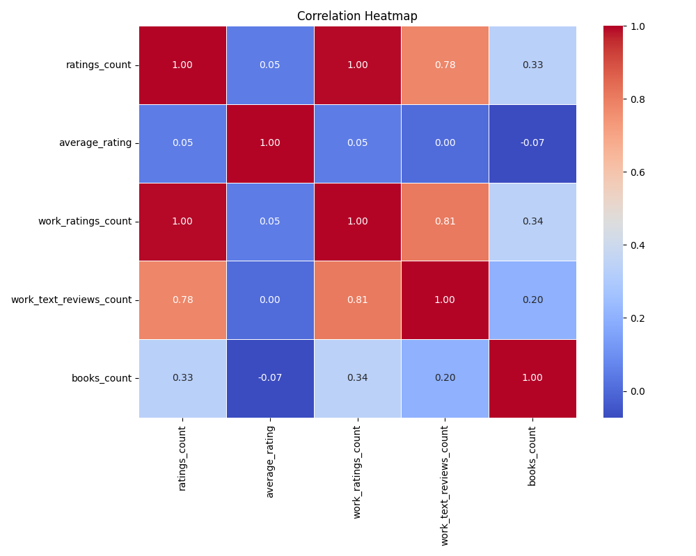
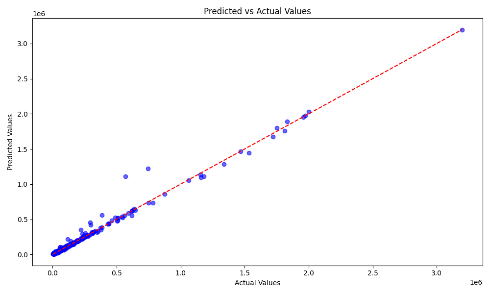
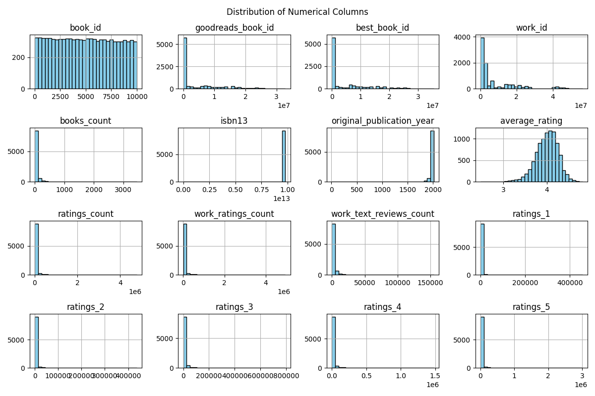
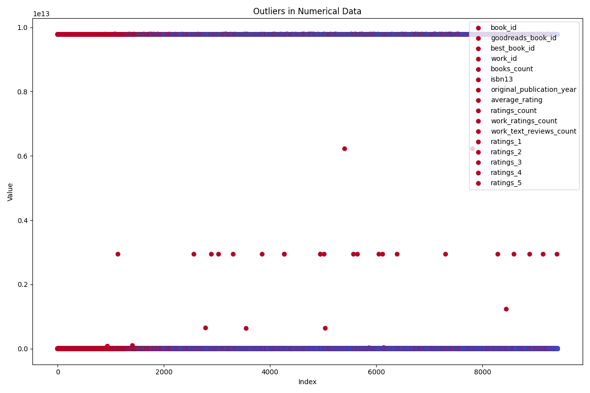
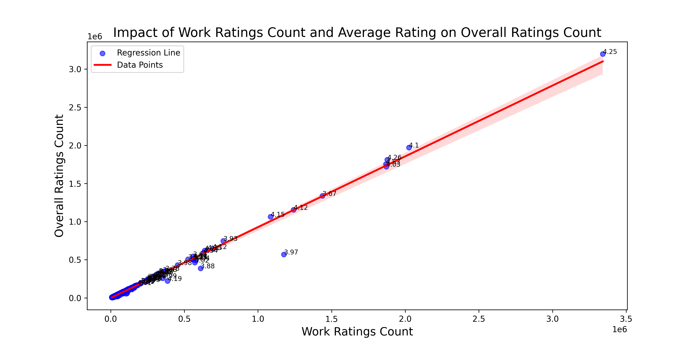

# Basic Analysis of Goodreads Dataset 

## General Information
- **File Path**: goodreads.csv
- **Encoding**: utf-8
- **Total Rows**: 9415

## Key Findings
- **Columns Overview**: 
  - 16 attributes related to books including IDs, author information, publication years, ratings, and image URLs.

- **Authors**:
  - Total unique authors: 4450
  - Most frequent author: Nora Roberts (59 books)

- **Publication Year**:
  - Range: 8 to 2017
  - Mean publication year: 1988.9

- **Ratings**:
  - Average rating: 4.0/5
  - Total ratings count ranges widely: 2,773 (min) to 4,780,653 (max)

- **Books Count**:
  - Mean books per author: ~77.82
  - High variability (Std Dev: 170.17), indicating some authors have significantly more books.

- **ISBN Information**:
  - Variation in ISBNs exists, with some repeats detected (e.g., `isbn` top value '0' occurred 135 times).

- **Images**:
  - 6,179 unique image URLs, indicating good diversity in book covers.

## Implications
- **Diversity of Content**: The dataset reflects a rich diversity of authors and books, providing a solid foundation for recommendations or analyses of trends in literature.

- **Publication Trends**: The distribution of publication years can inform publishers about historical book trends and assist in targeting current market demands.

- **Rating Insights**: The average rating suggests a generally positive reception, which can be used for marketing and recommendation systems.

- **Future Work**: Potential for deeper analysis in patterns of author productivity, correlation between ratings and publication year, and examining reader demographics based on language distribution.

- **Quality Control**: Presence of repeat or invalid ISBNs calls for further data cleansing and validation to ensure accurate bibliographic information.

# Analysis of Correlation Heatmap

## Overview
The correlation heatmap illustrates the relationships between different variables, providing insight into how they interact with one another.

## Variable Analysis

1. **ratings_count**:
   - Strong positive correlation with **work_ratings_count** (0.81) and **work_text_reviews_count** (0.78).
   - Moderate correlation with **average_rating** (0.05) and **books_count** (0.33).
   - **Implication**: Higher ratings count tends to align with increased work ratings and reviews, but does not significantly affect average rating or number of books.

2. **average_rating**:
   - Weak positive correlations with all variables, notably with **ratings_count** (0.05) and **work_text_reviews_count** (0.20).
   - Slightly negative correlation with **books_count** (-0.07).
   - **Implication**: The average rating shows limited influence from other metrics, suggesting that it may be an independent measure.

3. **work_ratings_count**:
   - Strong positive correlation with both **ratings_count** (0.81) and **work_text_reviews_count** (0.81).
   - Moderate correlation with **books_count** (0.20).
   - **Implication**: More work ratings lead to an increase in both ratings and reviews, suggesting a cumulative effect on engagement.

4. **work_text_reviews_count**:
   - Similar trends as **work_ratings_count**, with a strong correlation to **ratings_count** (0.78) and moderate correlation with **work_ratings_count** (0.81).
   - Weak positive correlation with **books_count** (0.20).
   - **Implication**: Increased text reviews may drive the quantity of ratings, indicating that qualitative feedback can enhance engagement metrics.

5. **books_count**:
   - Weak correlations across the board, particularly with **ratings_count** (0.33) and **work_text_reviews_count** (0.20).
   - **Implication**: Number of books has lesser impact on reviews and ratings, pointing toward a more complex relationship that may involve external factors.

## Overall Implications
- High correlation between **ratings_count**, **work_ratings_count**, and **work_text_reviews_count** suggests a cohesive interaction among these metrics.
- The weak correlations with **average_rating** and **books_count** highlight potential areas for further investigation regarding the nature of ratings and their dependency on external aspects.
- These insights can aid in strategic planning for enhancing engagement through targeted improvements in feedback mechanisms or content production.

## Recommendations
- Focus on increasing **work_ratings_count** and **work_text_reviews_count** to boost overall **ratings_count**.
- Explore strategies to improve average ratings, independent of other metrics.
- Consider researching external factors influencing **books_count** and its relationship with engagement metrics.

# Analysis of the Predicted vs Actual Values Graph

## Overview
The graph illustrates a scatter plot where the x-axis represents the actual values and the y-axis represents the predicted values from a regression analysis. The red dashed line indicates the ideal scenario where predicted values perfectly match actual values.

## Key Observations
1. **Trend Alignment**: 
   - The points are generally concentrated along the red dashed line, indicating a strong positive correlation between actual and predicted values.

2. **Variance in Predictions**:
   - While most points are close to the dashed line, some points deviate. This suggests that the model makes accurate predictions for most data points but struggles with a few.

3. **Outliers**:
   - A small number of points appear farther from the line, indicating potential outliers or regions where the model may not perform well.
   - Identifying these outliers can provide insights into areas the model could improve upon or elements it could have missed.

4. **Model Performance**:
   - The overall tight clustering of points around the line suggests that the regression model has a good fit, likely indicating that the predictors used in the model explain a substantial portion of the variance in the actual values.

## Implications
- **Model Validation**: The high alignment with the red line suggests that the regression model is effective, but further validation may be needed, especially with outliers.
- **Model Improvement**: Investigate the outliers to enhance model accuracy—consider adding more features or transforming existing ones.
- **Decision Making**: If this analysis forms the basis of forecasting or predictions in a business or scientific context, stakeholders may have a reasonable level of confidence in the model's outputs.
- **Further Analysis**: Additional metrics such as R-squared, RMSE, or MAE should be calculated to quantify model accuracy and guide potential refinements. 

## Conclusion
The scatter plot indicates a generally strong relationship between predicted and actual values in the regression analysis, with room for improvement through further investigation of deviations and outliers. Integrating additional diagnostic measures will enhance the understanding and effectiveness of the predictive model.

# Analysis of Outliers in Numerical Data

## Overview
The provided graph displays numerical data points identified as outliers within a specific dataset. The vertical axis represents the "Value" of various attributes, while the horizontal axis indicates their "Index."

## Key Observations
1. **Presence of Outliers**:
   - Numerous points appear significantly dispersed from the main cluster of data, particularly near the lower end of the Value axis. These likely represent outliers or anomalies.
   - The majority of the points are concentrated around a low value, suggesting that most attributes fall within a specific range.

2. **Attribute Identification**:
   - Each point is color-coded by attribute, indicating multiple variables being assessed for outliers, such as `average_rating`, `work_ratings_count`, and others related to `ratings`.

3. **Number of Outliers**:
   - A considerable number of points, perhaps corresponding to extreme ratings or user interactions, fall outside the typical range. This is particularly apparent at the extremes: both very low and high indices suggest variability that is not representative of the main data cluster.

## Implications
1. **Data Integrity**:
   - The presence of outliers raises concerns about data accuracy or collection methods. It may indicate erroneous data entry or unusual behavior in the underlying dataset.

2. **Need for Further Investigation**:
   - Outliers require further examination to understand their causes. This may involve data cleaning or validation to ensure that these values are legitimate or if they need to be corrected or removed.

3. **Impact on Analysis**:
   - Outliers can significantly skew analysis results, particularly in statistical calculations (e.g., mean, variance). Using measures that are less sensitive to outliers (e.g., median) may provide more robust insights.

4. **Potential Action Items**:
   - Consider implementing anomaly detection methods to categorize or address these outlier points.
   - Develop a strategy for handling these outliers in any predictive modeling or analytical endeavors, such as using robust statistical methods or exclusion criteria.

5. **Visual Insights**:
   - The graph effectively visualizes where anomalies lie within the dataset, providing a clear direction for deeper analysis and potential remediation approaches.

## Conclusion
The graph serves as a powerful tool for highlighting outliers within a dataset related to `ratings` and `books`. Identifying outliers is essential for ensuring data integrity and achieving accurate statistical analysis. Further investigation and appropriate handling strategies are recommended to address these anomalies.

# Detailed Analysis of the K-Means Clustering Graph

## Overview
The graph illustrates the results of the K-Means clustering algorithm applied to a dataset, utilizing the first two principal components derived from PCA (Principal Component Analysis). The number of clusters (k) is set to 4, and points are colored according to their designated cluster labels.

## Graph Components
1. **Axes**:
   - **PCA Component 1**: Represents the first principal component, capturing the most variance in the data.
   - **PCA Component 2**: Represents the second principal component, summarizing the second most variance.

2. **Data Points**:
   - Each point corresponds to an observation from the dataset.
   - Points are colored based on their cluster assignment, with a gradient scale indicating the cluster label.

3. **Color Gradient**:
   - The colors ranging from purple to cyan demonstrate the different clusters identified by the algorithm.

## Cluster Distribution
- **Density**: 
  - There seems to be a dense cluster of data points in the lower left quadrant, indicating a significant concentration of observations in that area.
  - Sparse regions, especially in the upper right, suggest fewer observations, possibly indicating outliers or less common behavior.

- **Distinct Clusters**:
  - There are visible separations between some clusters, particularly the yellow and green clusters, which may indicate different underlying patterns in the data.
  - The purple cluster appears to contain the most observations, possibly suggesting a more prevalent category or group in the dataset.

## Implications
1. **Cluster Interpretation**:
   - The distinct clusters may represent different groups or segments within the data, which could inform targeted strategies for analysis or intervention based on their properties.

2. **Model Validity**:
   - The clarity of separation among clusters suggests that the choice of k=4 is appropriate, but further evaluation might be warranted (like silhouette scores or elbow method) to optimize cluster number.

3. **Data Insights**:
   - The variation in cluster sizes indicates that while some groups are well-represented, others are less prominent, possibly signaling areas for further study or data collection.

4. **Further Analysis**:
   - Investigating the nature of each cluster could provide actionable insights; for instance, examining the characteristics of points in the dense cluster vs. the sparse cluster.

5. **Potential Outliers**: 
   - Observations that are isolated from the main clusters might be outliers or noise in the data, warranting deeper investigation to understand their influence.

## Conclusion
The K-Means clustering results displayed in this graph reveal distinct groupings among the dataset based on variance captured by PCA. Understanding these clusters enhances the potential for nuanced analysis and decision-making grounded in data patterns. Further exploration of each cluster will likely yield insights relevant to the overarching problem statement.

# Analysis Statement: Investigate the impact of work ratings count and average rating on the overall ratings count of books to identify key factors influencing reader engagement on Goodreads.

## Detailed Analysis of the Graph

### Overview
The graph illustrates the relationship between two primary variables: **Work Ratings Count** (on the x-axis) and **Overall Ratings Count** (on the y-axis). The regression line represents the linear relationship derived from the data points.

### Key Observations
1. **Positive Correlation**: 
   - There is a strong positive correlation between Work Ratings Count and Overall Ratings Count, indicating that as the number of work ratings increases, the overall ratings count tends to increase as well.

2. **Regression Line**: 
   - The regression line reflects a consistent upward trend, which suggests that the relationship is linear.
   - The slope of the regression line indicates the degree of change in Overall Ratings Count for each increase in Work Ratings Count.

3. **Data Density**:
   - The concentration of data points around the regression line implies that most books fall along this trend, suggesting uniform reader engagement across the dataset.

4. **Outliers**:
   - A few points diverge from the regression line significantly (e.g., labeled d1, d25). These outliers could represent books that have unusually high or low overall ratings relative to their work ratings count, prompting further investigation into their attributes.

5. **Range of Ratings**:
   - The x-axis shows an extensive range for Work Ratings Count, while the y-axis also covers a similar range for Overall Ratings Count, demonstrating variations across different books.

### Implications
- **Reader Engagement**: The positive correlation suggests that books with higher work ratings counts are likely to have higher overall ratings counts, implying that reader engagement may be enhanced by a greater number of ratings.
- **Marketing Insights**: Publishers and authors may focus on increasing the number of ratings (e.g., promotional events, outreach) to boost overall reader engagement, potentially leading to higher visibility of the books.
- **Quality Indicators**: Books showing significant divergence from the regression line may indicate factors like thematic popularity, author prominence, or niche markets that warrant further exploration.
- **Data Validation**: The presence of outliers necessitates a deeper analysis to understand unique factors influencing those specific books, which could inform targeted strategies for marketing and engagement.

### Conclusion
The investigation highlights the critical relationship between work ratings and overall ratings counts, emphasizing factors that drive reader engagement. Addressing outliers and understanding underlying dynamics can lead to more effective strategies in maximizing reader interaction on platforms like Goodreads.
