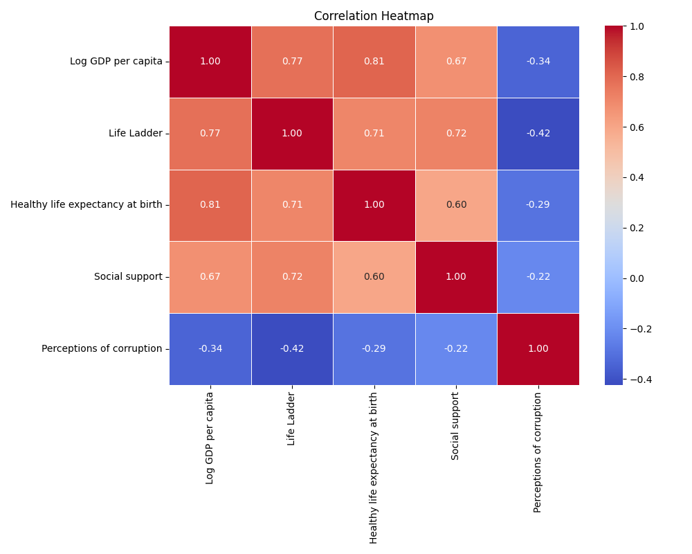
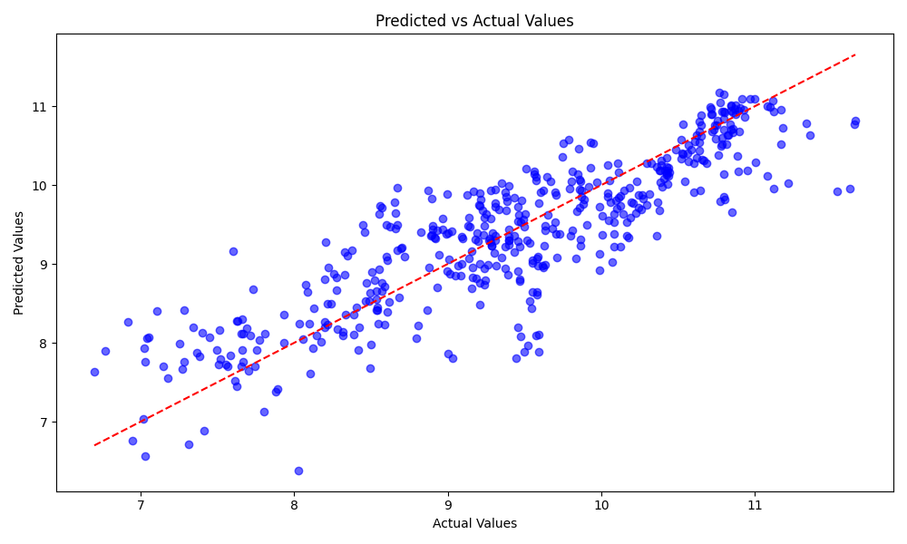
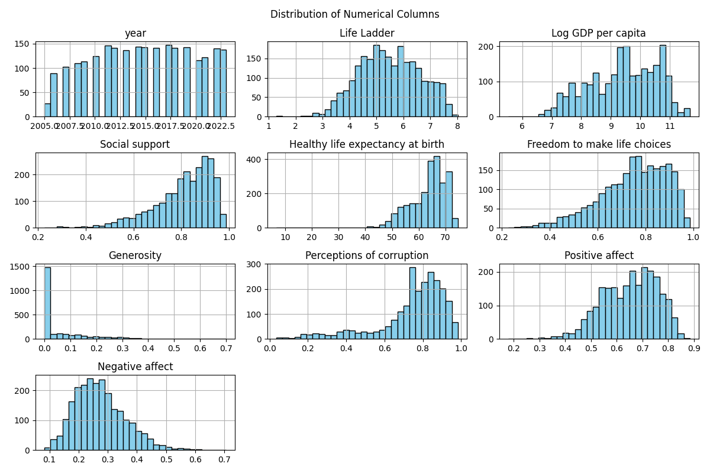
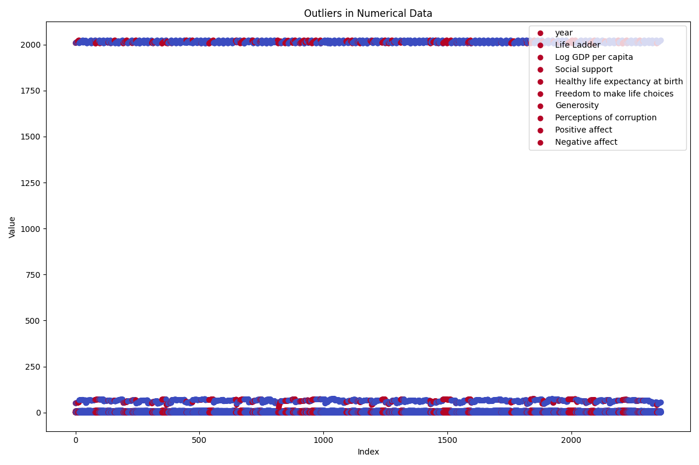
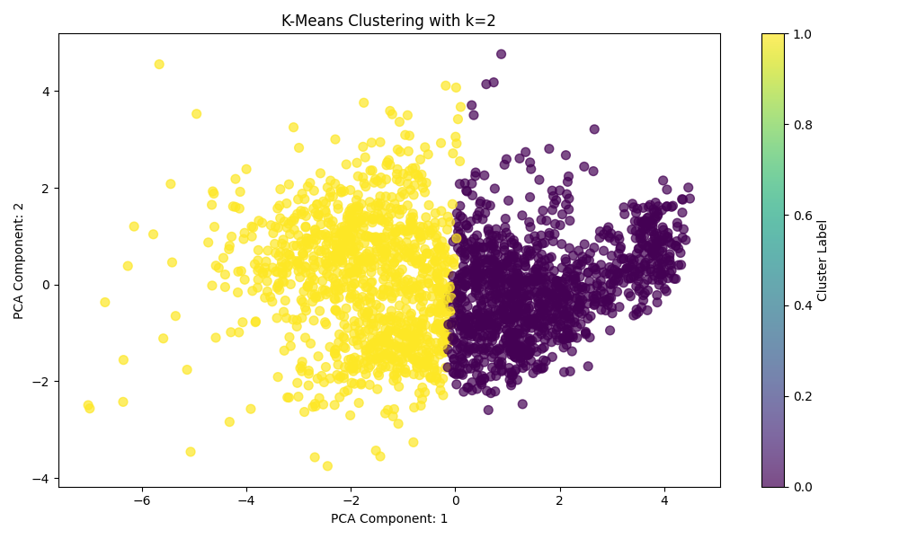
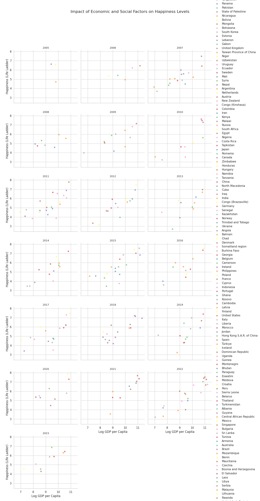

# Happiness Data Analysis

## Overview
The dataset contains happiness-related metrics across various countries and years with 2,363 entries pertaining to 165 unique countries from 2005 to 2023.

## Key Metrics Summary
- **Life Ladder**: 
  - Mean: 5.48  
  - Min: 1.28, Max: 8.02  
  - Indicates overall happiness levels, with a notable range reflecting varying experiences among countries.
  
- **Log GDP per capita**: 
  - Mean: 9.40  
  - Min: 5.53, Max: 11.68  
  - Suggests a link between economic performance and happiness. Higher GDP generally correlates with higher happiness levels.

- **Social Support**: 
  - Mean: 0.81  
  - Min: 0.23, Max: 0.99  
  - Social networks appear crucial for perceived happiness, with a strong positive influence expected.

- **Healthy Life Expectancy**: 
  - Mean: 63.40 years  
  - Min: 6.72, Max: 74.60  
  - Healthier populations tend to report higher happiness. The significant variance signals disparities in health across countries.

- **Freedom to Make Life Choices**: 
  - Mean: 0.75  
  - Min: 0.23, Max: 0.99  
  - Freedom is likely a key contributor to happiness, with higher ratings associated with greater life satisfaction.

- **Generosity**: 
  - Mean: 0.06  
  - Min: 0.00, Max: 0.70  
  - Indicates lower levels of financial generosity may correlate with lower happiness metrics.

- **Perceptions of Corruption**: 
  - Mean: 0.74  
  - Min: 0.04, Max: 0.98  
  - Higher corruption perceptions potentially diminish happiness and overall life satisfaction.

- **Positive vs. Negative Affect**: 
  - Positive: Mean: 0.65  
  - Negative: Mean: 0.27  
  - The balance of positive to negative feelings appears crucial, with higher positive affect contributing to perceived happiness.

## Implications
- **Policy Focus**: 
  - To enhance societal happiness, policymakers should emphasize economic stability, health improvements, and social support structures.

- **Societal Interventions**: 
  - Efforts to reduce corruption and enhance freedom of choice can positively affect happiness levels.

- **International Comparison**: 
  - Understanding variations in scores across countries can inform targeted programs and international aid discussions.

- **Future Research**: 
  - Further investigation into the correlation between psychological well-being and economic indicators may yield insights to optimize societal happiness.

#Correlation Heatmap: 

# Correlation Heatmap Analysis

## Overview
The correlation heatmap visually represents the relationships between multiple variables, specifically emphasizing how closely related they are through numerical values ranging from -1 to 1.

## Variables Analyzed
1. **Log GDP per capita**
2. **Life Ladder**
3. **Healthy life expectancy at birth**
4. **Social support**
5. **Perceptions of corruption**

## Correlation Values
- **Strong Positive Correlations (0.5 to 1.0)**
  - **Life Ladder & Log GDP per capita (0.77)**: Indicates that higher GDP per capita strongly correlates with a higher life satisfaction score.
  - **Life Ladder & Healthy life expectancy at birth (0.71)**: Suggests that increases in life satisfaction are associated with improvements in healthy life expectancy.
  - **Social support & Healthy life expectancy at birth (0.67)**: Implies that better social support is linked with increased healthy life expectancy.

- **Moderate Positive Correlations (0.3 to 0.5)**
  - **Log GDP per capita & Social support (0.42)**: Indicates a moderate relationship between economic wealth and perceived social support.
  
- **Moderate to Weak Negative Correlations (-0.3 to 0)**
  - **Perceptions of corruption & Life Ladder (-0.34)**: Indicates that higher perceptions of corruption are moderately negatively correlated with life satisfaction.
  - **Life Ladder & Perceptions of corruption (-0.22)**: Weakly hints that decreases in life satisfaction may be associated with higher perceptions of corruption.

- **Weak Negative Correlations (-0.3 to 0)**
  - **Healthy life expectancy at birth & Perceptions of corruption (-0.29)**: Suggests a slight negative relationship where individuals with a longer healthy life expectancy may perceive corruption less.

## Implications
1. **Economic Policies**: The strong correlation between GDP and life satisfaction indicates that economic growth initiatives may enhance quality of life, reinforcing the importance of economic policies that promote sustainable growth.

2. **Health Interventions**: The relationships between life satisfaction, healthy life expectancy, and social support suggest that health interventions should incorporate elements that enhance social networks to improve overall well-being.

3. **Corruption Awareness**: The negative correlations with perceptions of corruption suggest a need for transparency and effective governance to improve public trust, which may enhance life satisfaction and health outcomes.

4. **Policy Integration**: The interconnectedness of these variables indicates that addressing one area (like GDP) could have ripple effects on others (like health outcomes and social support), advocating for an integrated approach to policymaking.

5. **Future Research**: Further analysis could be conducted to explore causative factors and potential external influences affecting these correlations, informing targeted interventions for improving life satisfaction and overall health. 

## Conclusion
The correlation heatmap reveals valuable insights into the relationships among economic performance, health, social factors, and governance perceptions, highlighting critical areas for policy focus and public health strategies.

#Regression Analysis: 

# Analysis of Predicted vs Actual Values Graph

## Overview
The graph presents a scatter plot showcasing the relationship between predicted and actual values as part of a regression analysis. Each blue dot represents an individual data point, while the red dashed line indicates the trend of predictions made by the regression model.

## Key Observations
1. **Trend Line**:
   - The red dashed line appears to follow the general trend of the data points closely, indicating a good fit for the regression model.
   - The slope of the line suggests a positive correlation between predicted and actual values.

2. **Data Point Distribution**:
   - Most data points cluster around the trend line, suggesting that the predictions made by the model are generally accurate.
   - However, there are noticeable deviations from the trend line, particularly on both sides, indicating some variability in the predictions.

3. **Outliers**:
   - A few data points are significantly distant from the trend line, particularly on the higher end of actual values. This suggests that there are some instances where the model's predictions may be inaccurate.
   - These outliers could skew the overall performance metrics of the model, highlighting areas for improvement.

4. **Range of Values**:
   - The x-axis (actual values) ranges from approximately 7 to 11, while the y-axis (predicted values) also exhibits a similar range. The close ranges suggest that the model's predictions are reasonably aligned with the scale of actual observations.

5. **Correlation**:
   - The strong clustering of points around the trend line indicates a high degree of correlation between the predicted and actual values, which is desirable in regression analysis.

## Implications
- **Model Performance**:
  - The positive correlation and clustering of points around the trend line imply that the regression model is effective for predicting values within the observed range.
  
- **Potential Model Improvements**:
  - The presence of outliers suggests that there are specific cases where the model does not perform well. Investigating these outliers may provide insights for model tuning or feature engineering.
  
- **Further Validation**:
  - Additional validation metrics (e.g., R-squared, MAE, RMSE) can be employed to quantify the model's performance and identify areas needing enhancement.

- **Understanding Variability**:
  - Analyzing the factors leading to deviations from the trend line could help in understanding the underlying variability in the data, which may not be captured by the current model.

## Conclusion
The graph indicates a generally effective regression model with a strong positive correlation between predicted and actual values. However, the presence of outliers calls for a deeper investigation to enhance model accuracy and performance further.

#Outlier Detection: 

# Outlier and Anomaly Detection Analysis

## Overview
The provided scatter plot displays various indicators against their index, with data points categorized by attributes such as GDP per capita, life expectancy, social support, etc. Outliers are highlighted, indicating values that deviate significantly from other observations.

## Detailed Analysis

### Axes Description
- **X-axis (Index)**: Represents the index of observations in the dataset.
- **Y-axis (Value)**: Indicates the value of the metric being measured, which could include life ladder scores, GDP per capita, etc.

### Data Points
- **Blue Points**: Represent the main bulk of the data.
- **Red Points**: Indicate outliers or anomalies in the dataset.

### Groupings
1. **Life Ladder**
2. **Log GDP per capita**
3. **Healthy life expectancy at birth**
4. **Social support**
5. **Generosity**
6. **Perceptions of corruption**
7. **Positive affect**
8. **Negative affect**

### Outlier Detection
- Outliers are evident in the display, primarily as red dots that are separated from the larger cluster of blue points.
- The data suggests that for certain indicators, there are extreme values that could impact analyses or interpretations significantly.

### Implications
- **Data Quality**: The presence of outliers may indicate issues with data collection or entry, necessitating a review for data quality and integrity.
- **Statistical Analysis**: Outliers can skew results in statistical analyses, such as means, regressions, and correlation assessments. It is vital to assess whether these outliers should be included or removed when analyzing relationships.
- **Policy Implications**: If certain outliers represent specific cases (e.g., exceptionally high or low life expectancy), it could lead to targeted interventions or studies on those anomalies.
- **Predictive Modeling**: In the context of machine learning, outliers can lead to overfitting, adversely affecting the model’s performance. Proper handling of outliers is essential for building robust predictive models.
- **Further Investigation**: The existence of outliers may prompt further investigation into the causes behind such deviations, potentially uncovering underlying issues or trends within the dataset.

### Conclusion
This analysis highlights the importance of recognizing and appropriately dealing with outliers in numerical data. Correct handling can lead to better insights and more accurate modeling in various applications, including economic, social, and health-related studies.

#Clustering: 

## Analysis of K-Means Clustering Graph

### Graph Overview
The provided scatter plot illustrates the results of K-Means clustering with \( k=2 \) on a dataset reduced to two principal components (PCA Component 1 and PCA Component 2). The graph uses color coding to differentiate the two clusters identified by the algorithm: yellow and purple.

### Key Features
- **PCA Components**: 
  - **X-Axis (PCA Component 1)**: Represents the first principal component, capturing the most variance in the data.
  - **Y-Axis (PCA Component 2)**: Represents the second principal component, which captures the second most variance.
  
- **Clusters**: 
  - The yellow cluster on the left side indicates one grouping of data points.
  - The purple cluster on the right side indicates another distinct grouping.

### Observations
1. **Separation**: 
   - There is a clear separation between the two clusters. This suggests that the data points within each cluster are more similar to each other than to those in the other cluster.

2. **Density**: 
   - The yellow cluster appears to be dense and more compact, whereas the purple cluster is slightly more spread out, indicating variability within that group.

3. **Potential Outliers**: 
   - Verification for any outliers should be conducted, especially near the boundaries of the clusters where points might exist that do not fit neatly into either cluster.

### Possible Implications
1. **Pattern Recognition**: 
   - The clear delineation between clusters may suggest underlying patterns in the dataset. This can aid in identifying characteristics that define each cluster.

2. **Feature Engineering**: 
   - The results may prompt a further investigation into which features contribute most significantly to the separation of these clusters, guiding future data collection and feature selection.

3. **Cluster Interpretation**: 
   - Domain knowledge can be applied to interpret the clusters meaningfully, possibly linking the clustered data points to specific categories or behaviors in the real world.

4. **Segmentation**: 
   - The results can facilitate segmentation strategies for targeted analysis, marketing, or resource allocation based on the clustering outcomes.

5. **Model Evaluation**: 
   - The effectiveness of the K-Means algorithm here can be judged by the clear differentiation of clusters. It may encourage experimentation with different values of \( k \) or other clustering algorithms for potential improvements.

### Conclusion
This clustering graph effectively demonstrates the separation of two groups within the data set, providing actionable insights for interpretation and further exploration in the context of data analysis and decision-making.

#Analysis Statement: "Investigate the impact of economic and social factors on happiness levels across different countries over time, focusing on the relationships between GDP per capita, social support, healthy life expectancy, and perceptions of corruption."

# Analysis of the Graph: Impact of Economic and Social Factors on Happiness Levels

## Overview
The graph illustrates the relationship between multiple economic and social indicators (GDP per capita, social support, healthy life expectancy, and perceptions of corruption) and happiness levels across various countries over the years 2010-2018. Each subplot represents data for a specific year.

## Key Variables
- **X-axis:** Logarithm of GDP per capita
- **Y-axis:** Happiness levels (indexed or scale not provided)
- **Points:** Represent countries, color-coded for differentiation.

## Time Series Observations
1. **Trends Over Years:** 
   - A vertical arrangement for each year allows for year-on-year comparison of the countries’ happiness levels against their economic indicators.
   - It appears that countries exhibit different patterns of happiness despite similar levels of GDP per capita.

2. **Overall Trends:**
   - A general upward trend in happiness levels correlated with higher GDP per capita can be noted in several years.
   - However, there is considerable variance, suggesting that GDP alone does not determine happiness levels.

## Economic Factor Analysis (GDP per Capita)
1. **Correlation:**
   - As GDP increases, some countries report higher happiness levels, but this relationship shows diminishing returns—countries with very high GDP do not necessarily have the highest happiness (e.g., affluent countries exhibiting lower happiness).

2. **Outliers:**
   - Some countries with lower GDP per capita achieving significant happiness levels challenge the expected correlation, indicating other influential factors.

## Social Factors Analysis
1. **Social Support:**
   - The analysis suggests social support plays a critical role; countries with higher social support ratings tend to report higher levels of happiness even at lower GDP levels.

2. **Healthy Life Expectancy:**
   - A potential connection exists where higher healthy life expectancy correlates with increased happiness. Countries showing significant life expectancy improvement trend higher on the happiness index.

3. **Perceptions of Corruption:**
   - Countries reporting lower perceptions of corruption often achieve higher happiness levels. This variable appears crucial, as high corruption is typically linked to lower public trust and satisfaction.

## Implications
- **Policy Recommendations:**
  - Focus on strengthening social support systems as they may have a more pronounced effect on happiness than economic growth alone.
  - Reducing corruption and increasing transparency can boost national happiness levels.
  - Health initiatives that enhance life expectancy should be prioritized alongside economic policies.

- **Future Research:**
   - Further investigation into specific social factors and their relative weights in influencing happiness could yield actionable insights.
   - Longitudinal studies expanding beyond 2018 could provide clarity on evolving country dynamics.

## Conclusion
The analysis indicates that while economic factors like GDP per capita have a role, social elements, perceptions of corruption, and public health significantly impact happiness levels. Policymakers should not only concentrate on economic growth but also prioritize social and governance factors to enhance overall well-being.
