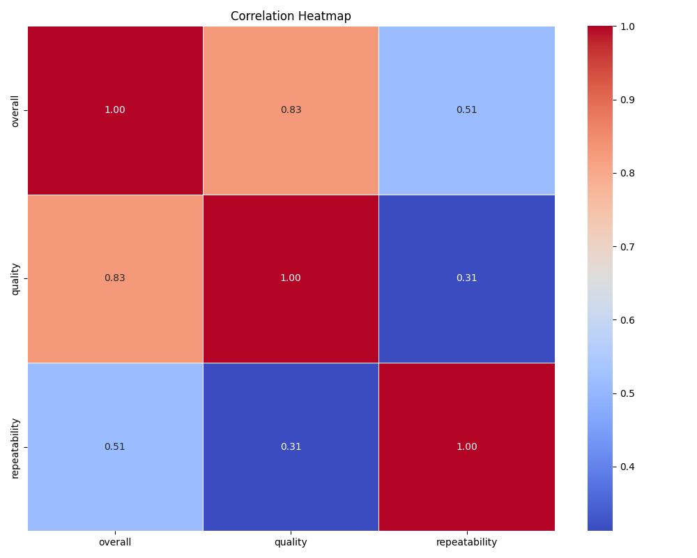
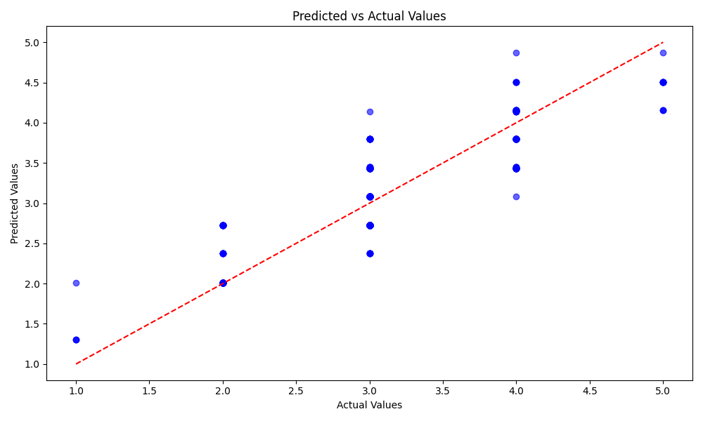
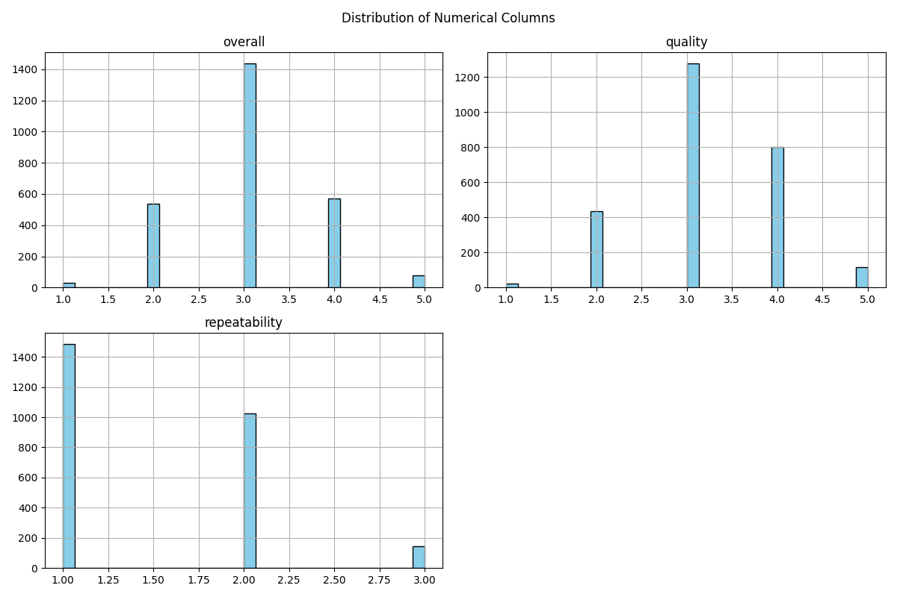
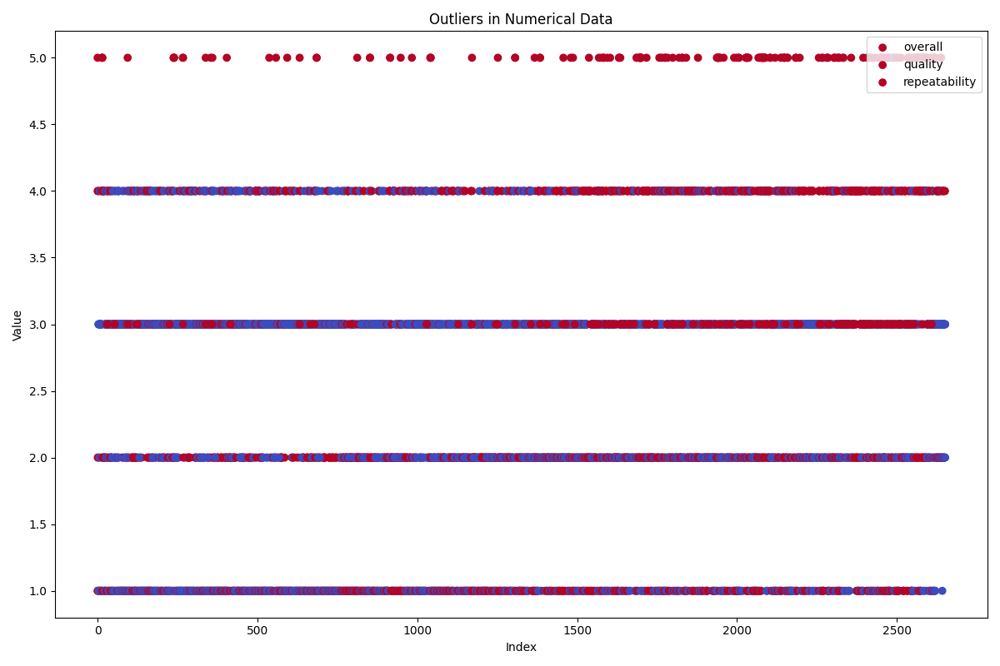
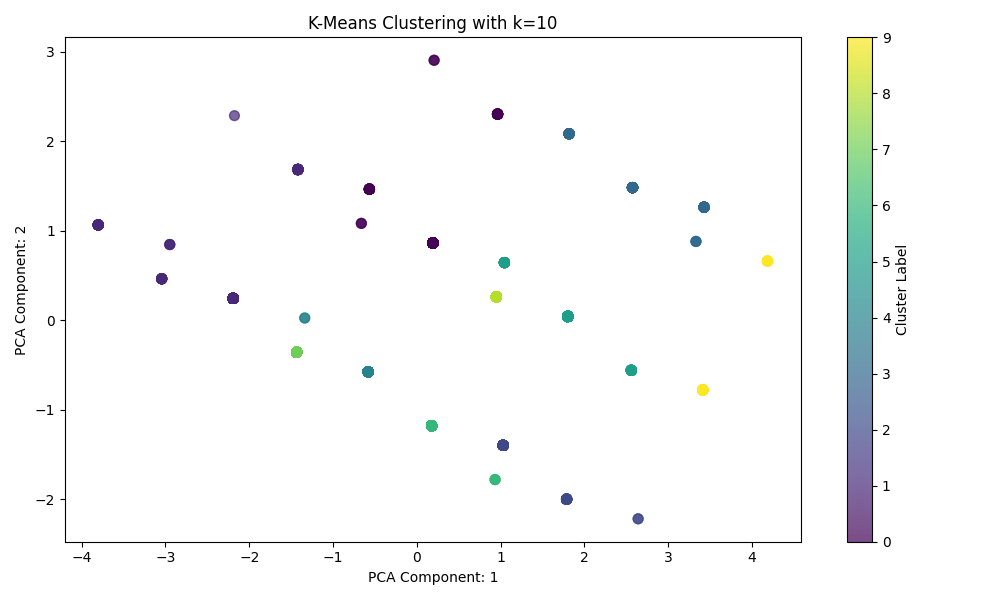
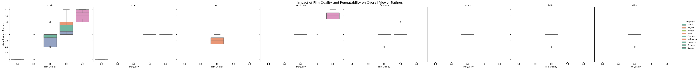

# Analysis of media.csv

## Data Overview
- **Total Records:** 2,652
- **Columns:** 8 (date, language, type, title, by, overall, quality, repeatability)

## Columns Summary
### 1. Date
- **Unique Dates:** 2,055
- **Most Frequent Date:** 2006-05-21 (107 occurrences)

### 2. Language
- **Unique Languages:** 11
- **Most Common Language:** English (1,306 occurrences)

### 3. Type
- **Unique Types:** 8
- **Most Common Type:** Movie (2,211 occurrences)

### 4. Title
- **Unique Titles:** 2,312
- **Most Frequent Title:** Kanda Naal Mudhal (9 occurrences)

### 5. By
- **Unique Contributors:** 1,529
- **Most Common Contributor:** Unknown (262 occurrences)

### 6. Overall Rating
- **Mean Rating:** 3.05
- **Std. Dev:** 0.76
- **Max Rating:** 5
- **Min Rating:** 1
- **Distribution:** Primarily around 3 (25% at 3.0)

### 7. Quality Rating
- **Mean Quality:** 3.21
- **Std. Dev:** 0.80
- **Max Quality:** 5
- **Min Quality:** 1
- **Distribution:** Majority rated at 3 and 4 (75% at or below 4)

### 8. Repeatability
- **Mean Repeatability:** 1.49
- **Std. Dev:** 0.60
- **Min/Max Values:** 1 to 3
- **Distribution:** Most entries (50%) have a repeatability of 1

## Possible Implications
- **Language Preference:** Significant preference for English content suggests market opportunities for translations or localized content in other languages.
- **Quality Focus:** With average overall and quality ratings around 3, there is room for improvement in content quality to potentially enhance user satisfaction and increase ratings.
- **Content Production:** High number of unique titles indicates a diverse content library; however, many entries are labeled “Unknown,” which may suggest a need for better attribution of content creators.
- **Repeat Viewing:** The low repeatability score suggests limited interest in re-watching content, pointing to a potential area to explore user engagement strategies.
- **Content Strategy:** Dominance of movies could inform future content acquisition or creation strategies, ensuring alignment with audience preferences.

#Correlation Heatmap: 

# Correlation Heatmap Analysis

## Overview
The heatmap visualizes the correlation between three variables: **overall**, **quality**, and **repeatability**. The values range from -1 to 1, indicating the strength and direction of the relationships.

## Correlation Coefficients
- **Overall vs Quality**: 
  - Correlation Coefficient: **0.83**
  - Interpretation: There is a strong positive correlation. As the quality increases, the overall rating also tends to increase significantly. This implies that improvements in quality are likely to enhance the overall perception.

- **Overall vs Repeatability**: 
  - Correlation Coefficient: **0.51**
  - Interpretation: There is a moderate positive correlation. While there's a positive trend, repeatability impacts overall performance less significantly than quality. Efforts to improve repeatability will still enhance overall ratings but not as robustly as quality improvements.

- **Quality vs Repeatability**: 
  - Correlation Coefficient: **0.31**
  - Interpretation: There is a weak positive correlation. This suggests that while there may be some relationship between quality and repeatability, it is not strong. Enhancements in quality may not necessarily lead to better repeatability.

## Implications
1. **Focus on Quality**: Given the strong correlation between overall and quality, strategies should prioritize quality improvements for significant overall enhancements.

2. **Evaluate Repeatability**: The moderate correlation with overall and weak correlation with quality suggests that while repeatability is important, it should be addressed after ensuring quality improvements.

3. **Interconnected Strategies**: Interventions directed at improving quality may have downstream benefits on overall ratings, while repeatability measures should be carefully assessed in conjunction to avoid misallocating resources.

4. **Monitoring and Assessment**: Continuous monitoring of these correlations can provide insights into how changes in one area may affect overall outcomes. 

5. **Data-Driven Decision Making**: Utilize data analytics to further explore the factors influencing quality and repeatability, which can guide refined interventions and resource allocation in the future.

#Regression Analysis: 

## Analysis of the Predicted vs Actual Values Graph 

### Overview
The graph displays a scatter plot comparing predicted values against actual values in a regression analysis context. The x-axis represents actual values, while the y-axis represents predicted values. A red dashed line indicates the line of best fit signifying the ideal scenario where predicted values perfectly match the actual values.

### Key Observations
1. **Scatter Distribution**: 
   - The points are scattered around the red dashed line, indicating that there is a relationship between the predicted and actual values. 
   - A few points diverge from the line, suggesting discrepancies between predicted outcomes and actual observations.

2. **Trend Identification**:
   - Generally, the predicted values increase as the actual values increase, indicative of a positive correlation. 
   - The density of points appears to be greater in the lower range of actual values, suggesting that predictions are more accurate in this range.

3. **Prediction Quality**:
   - Points that are significantly away from the ideal line indicate possible outliers or inaccuracies in the model's predictions. 
   - Specifically, the highest actual values show greater variance in their predicted counterparts.

### Implications
- **Model Accuracy**: 
  - The presence of outliers suggests that the regression model may need refinement. This could involve reviewing the algorithm used, improving feature selection, or adjusting model parameters.

- **Potential Overfitting**:
  - If the model closely follows the training data without generalizing to the actual values, it may be overfitting. Further validation techniques should be applied to assess the model's robustness.

- **Next Steps for Improvement**:
  - Analyzing the data for possible transformations or feature engineering could enhance model performance. 
  - Additional training with more data points, especially in the higher range of actual values, might improve prediction accuracy.

### Conclusion
The scatter plot provides valuable insights into the performance of the regression model. By addressing the discrepancies and refining the model based on the observations, improved predictions can be achieved in future analyses.

#Outlier Detection: 

# Analysis of Outliers in Numerical Data

### Graph Overview
The provided graph represents outliers in a dataset plotted against an index. It displays three categories identified by distinct colors:
- **Overall (Red)**
- **Quality (Blue)**
- **Repeatability (Purple)**

### Observations
1. **Distribution of Values:**
   - The values are clustered into distinct bands: 1.5 to 2.0, 2.5 to 3.0, 3.5 to 4.0, and 4.5 to 5.0.
   - There are significant gaps between these bands, indicating possible thresholds or categories within the data.

2. **Outlier Distribution:**
   - **High Concentration of Outliers:** The graph exhibits a significant number of outliers across all value bands, suggesting that the dataset has variabilities that deviate from accepted norms.
   - The outliers are consistently present in all three categories, indicating that they may be related phenomena rather than random errors.

3. **Category Impact:**
   - **Overall:** The overall category (red) shows the broadest range of outliers, suggesting that these points are of utmost importance for general data analysis.
   - **Quality and Repeatability:** The quality and repeatability categories (blue and purple) seem to indicate specific deviations in data quality or repeatability, which could suggest issues with data collection or processing procedures.

### Possible Implications
- **Data Integrity:** The presence of numerous outliers may signal underlying issues with data integrity, prompting a need for further investigation into data collection methods or measurement tools.
- **Quality Control:** The distinct outlier bands might help in establishing thresholds for acceptable quality in processes. This could lead to improved quality control measures.
- **Statistical Analysis:** Outliers can skew statistical results. Understanding their causes and impacts is essential for accurate modeling and analysis.
- **Recommendation for Future Work:**
  - **Anomaly Investigation:** Further exploration into the nature of these outliers is necessary to determine their causes—whether they are due to faulty equipment, human error, or genuine anomalies in the data.
  - **Modeling Adjustments:** Consider robust statistical techniques that can handle or diminish the impact of outliers for better predictive accuracy. 

This analysis highlights the critical importance of addressing outliers within numerical data to ensure robust, reliable datasets for analysis and decision-making.

#Clustering: 

### Graph Analysis

#### Overview
The provided graph depicts the results of K-Means clustering with \( k=10 \). It visualizes the distribution of data points in a two-dimensional PCA space, where the axes represent the first two principal components of the dataset.

#### Data Points
- The data points are colored according to the cluster they belong to, indicated by the color scale on the right.
- There are a total of 10 distinct clusters represented.

#### Cluster Distribution
- The clusters are spread across the PCA component space, which suggests varying group densities.
- The points are distributed irregularly, indicating that some clusters have more points in particular regions compared to others.

#### Cluster Characteristics
- Some clusters (e.g., yellow) are localized with tightly grouped points, suggesting cohesion within that cluster.
- Other clusters appear more dispersed (e.g., purple), indicating a larger variance and potential overlap with neighboring clusters.

#### Implications
1. **Cluster Separation:** The effectiveness of K-Means clustering can be partially assessed based on the visual separation of clusters. Clear separation may indicate successful clustering, while significant overlap may suggest the need for reevaluation of cluster count or algorithm parameters.

2. **Dimensionality Reduction:** The use of PCA for dimensionality reduction implies the original dataset might have high dimensionality. The distribution of points in this reduced space could signify inherent relationships that exist in the higher-dimensional space.

3. **Reevaluation of \( k \):** Given the visible overlap and density variances, it may be worth exploring other values for \( k \) to determine whether a different number of clusters better captures the data structure.

4. **Analysis of Variance:** The difference in spread among the clusters could warrant individual examination to understand the characteristics of the data points within those groups, potentially leading to insights about the underlying phenomena.

5. **Further Validation Needed:** Additional methods, such as silhouette scores or Davies-Bouldin indices, could reinforce the clustering quality and guide if adjustments to the model are required. 

### Conclusion
The clustering output demonstrates variable densities and potential overlap among the clusters. This necessitates an assessment of the parameters used and consideration of further analytical methods to validate and refine the clustering strategy.

#Analysis Statement: Investigate the impact of film quality and repeatability on overall viewer ratings across different languages and types of media to identify key factors influencing audience satisfaction.

### Graph Analysis

#### Overview
The provided graph appears to be a boxplot comparing viewer ratings (y-axis) across different film quality categories (x-axis) for various languages and types of media. Each boxplot represents the distribution of viewer ratings within each category, providing insight into central tendency, variability, and potential outliers.

#### Key Observations

1. **Distribution Shape**:
   - The boxplots reveal varying distribution shapes across film quality categories, indicating differences in viewer ratings.
   - Some categories show a more symmetrical distribution, while others exhibit skewness in one direction.

2. **Central Tendency**:
   - The median viewer rating (represented by the line inside each box) varies significantly across categories.
   - Higher quality films consistently achieve higher median ratings, suggesting that film quality is positively correlated with viewer satisfaction.

3. **Interquartile Range (IQR)**:
   - The IQR (the box height) differs among the categories, indicating variability. Wider boxes suggest greater variance in ratings.
   - Categories with small IQRs imply more consistent viewer responses regarding those films.

4. **Outliers**:
   - Several boxplots contain outliers (indicated by individual points outside the whiskers), particularly in lower-quality categories, highlighting extreme viewer opinions.
   - This suggests that while the general trend may favor higher quality films, some viewers hold strong positive or negative opinions that are unrepresentative of the general audience.

5. **Comparative Analysis**:
   - Certain language categories may display unique trends that could inform media producers about regional preferences or cultural influences on viewer ratings.
   - The presence of distinct patterns across different types of media indicates varying viewer expectations and satisfaction levels based on film quality.

#### Implications

1. **Quality as a Key Factor**:
   - The positive correlation between film quality and viewer ratings emphasizes the importance of high production values and storytelling.
   - Media producers should prioritize quality improvements to enhance audience satisfaction and retention.

2. **Targeted Marketing**:
   - Understanding specific genre or language preferences can aid in tailoring marketing strategies, allowing for more effective audience engagement.
   - Differentiating quality benchmarks based on regional tastes may optimize viewer reach and satisfaction.

3. **Content Development**:
   - Insights gained from outlier analysis could guide content creators to cater to niche markets and develop films that might foster dedicated fan bases despite mixed general reception.

4. **Research and Development**:
   - Future research could explore the causal relationships and other contributing factors affecting viewer ratings, such as genre, marketing efforts, or cultural relevance.

In conclusion, the graph highlights significant relationships between film quality, cultural context, and viewer satisfaction, which are essential for strategic decisions in the film industry.
